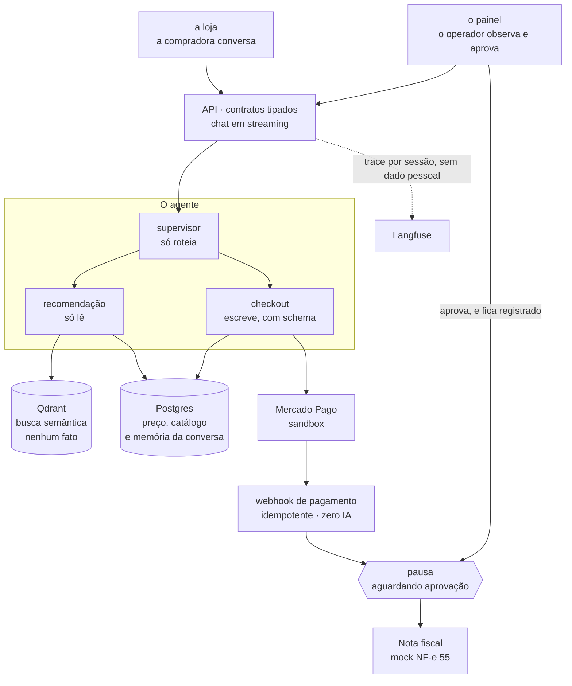

<p align="center">
  
</p>

<h1 align="center">Vendinha</h1>

<p align="center">
  <strong>Agente de vendas de ponta a ponta para eventos corporativos.</strong><br>
  Projeto de <strong>agosto de 2026</strong> do <a href="https://github.com/suajornadadedados/desafio-jornada/tree/main/desafio-vendas">Desafio Jornada de Dados</a> — tema do mês: <strong>Vendas</strong>.
</p>

<p align="center">
  <a href="https://github.com/suajornadadedados/vendinha-jornada/actions/workflows/ci.yml"></a>
  
  
  
  
</p>

> ### O LLM decide o que dizer. O código decide o que pode ser feito.
>
> Esta frase governa cada decisão do repositório. Preço, total, quantidade, corte por alérgeno
> e emissão de documento fiscal **nunca** passam pelo modelo.

---

## O desafio

O [Desafio Jornada de Dados](https://github.com/suajornadadedados/desafio-jornada) publica um
**pedido de cliente real por mês** — sem stack, sem arquitetura, sem numeração de requisitos.
Quem participa faz o discovery, documenta, decide e constrói no próprio repositório.

O desafio de agosto é o **Agente de Vendas de Ponta a Ponta**, e o cliente chega falando:

> *"Preciso de um presente pra minha sogra, que ama vinho tinto."*
>
> Filtro e categoria não resolvem essa frase. É por isso que existe um agente.

Ele quer oito coisas e teme outras seis. **Nenhum desses pedidos é um requisito de engenharia —
traduzir é o trabalho.** A tradução completa, com o que foi recusado em cada ponto, está em
[`docs/requisitos.md`](docs/requisitos.md).

## O que é a Vendinha

Um empório mineiro digital — queijos, cafés, doces, cachaças, petiscos — que vende **para
empresas**. Quem conversa com o agente é quem organiza o evento: gestora de RH, office manager,
assistente de diretoria. Ela recebeu uma tarefa com número e vai prestar contas ao financeiro.

> *"Café da manhã pra 40 pessoas, R$35 por cabeça, tem uma pessoa celíaca no time, e precisa
> chegar antes de quinta."*

O pedido não é um produto: é um **problema de composição**. O agente investiga o evento, monta a
cesta inteira, o código valida orçamento, slots e restrições, e o fluxo segue até o link de
pagamento e a emissão de NF-e com aprovação humana.

> **O case nasceu B2C e virou B2B no meio do projeto.** Uma pergunta de restrição única com 50
> itens no catálogo é respondível por inspeção — quem assiste conclui, com razão, que aquilo é um
> filtro de e-commerce com skin de chat. Trocar o **comprador** (e não o domínio) foi a decisão:
> [ADR-013](docs/adr/ADR-013-comprador-corporativo-composicao.md).

## A cena que resume o projeto

```
1. O atendente propõe     uma cesta de café da manhã para 40 pessoas
2. validar_composicao     "R$163 por pessoa — o teto é R$150. E faltou bebida quente."
                          ↳ recusado, com motivo. O modelo ajusta.
3. criar_pedido revalida  a mesma conferência roda de novo no servidor, na hora de fechar
```

Escolher *quais* produtos combinam com um time jovem numa sexta à tarde continua sendo do modelo
— é onde ele é insubstituível. O que o código não delega é a **conta** e o **corte**: quanto dá,
quantos atende, e o que não pode entrar. As duas chamadas ficam no mesmo trace: a fronteira deixa
de ser prosa e vira algo que dá para **assistir**.

A validação que passou pelo modelo nunca é a que autoriza.

---

## As duas telas

Duas abas, lado a lado: a mesma API servindo o cliente e o operador.

### `/` — o cliente é atendido

<p align="center">
  
</p>

A conversa começa pedindo o **evento**, não o produto. A landing é o simulador do canal do
cliente, e é honesta sobre o que existe: os tipos de evento oferecidos são exatamente os que o
validador sabe conferir, os produtores e as regiões são os do catálogo real, e não há um único
número inventado de "clientes atendidos". O `0` de *composições fora do orçamento apresentadas* é
uma invariante testada, não uma meta de marketing.

### `/admin` — o operador vê o atendimento acontecer

<p align="center">
  
</p>

O painel é **read-only** e atualiza sozinho por stream — não é polling. Repare em *Sugestões
barradas na conferência*: é a fronteira entre modelo e código exposta como métrica de operação —
quantas composições o código devolveu ao modelo, e por quê.

Num período sem atendimento, conversão e ticket médio aparecem como **traço**, nunca como zero.
Um painel que exibisse `0%` de conversão num dia sem conversa estaria afirmando algo falso sobre
um dia que não aconteceu.

---

## Subir a Vendinha

**Pré-requisito:** Docker rodando (no Windows e no macOS, o Docker Desktop aberto).

```bash
git clone https://github.com/suajornadadedados/vendinha-jornada && cd vendinha-jornada
cp deploy/.env.example deploy/.env
```

Preencha as cinco chaves de `deploy/.env` — o arquivo explica cada uma. Depois, um comando sobe
tudo:

```bash
docker compose -f deploy/docker-compose.yml up -d --build --wait
```

| Onde | O que é |
|---|---|
| **http://localhost:8080/** | a loja — a compradora corporativa conversa com o agente |
| **http://localhost:8080/admin** | o painel — o operador acompanha e aprova a nota fiscal |

```bash
docker compose -f deploy/docker-compose.yml logs -f api
docker compose -f deploy/docker-compose.yml down
```

**Isto empacota o produto; não o publica.** Sem TLS e sem autenticação real, este host não vai
para a internet aberta ([ADR-008](docs/adr/ADR-008-deploy-ambiente-unico.md)). Só o nginx publica
porta: banco e índice vetorial não são alcançáveis de fora.

▶ **Operar de verdade** — subir num servidor, hardening do host, backup e restore, rollback, e as
armadilhas que não dão erro compreensível: [`deploy/RUNBOOK.md`](deploy/RUNBOOK.md).

<details>
<summary><strong>Rodar em modo de desenvolvimento</strong> — para quem vai mexer no código</summary>

<br>

Aqui os pré-requisitos mudam: Docker, Python 3.12, [uv](https://docs.astral.sh/uv/) e Node 22.
O compose da raiz sobe **só** o banco e o índice; a API e as telas rodam na sua máquina, com
reload. `make` é conveniência — cada alvo é uma linha de comando real, e `make help` lista todos.

```bash
cp .env.example .env       # nada precisa ser preenchido para subir a infra e rodar os testes
make up                    # banco e índice vetorial, ~6s até healthy
make test                  # as duas camadas de teste
make lint                  # a mesma régua do CI
make hooks                 # instala os portões locais

make db-setup              # cria as tabelas
make seed                  # carrega os 65 produtos
make api                   # http://127.0.0.1:8000

make web-install
make web                   # http://localhost:5173 (loja) e /admin (painel)
```

**A API recusa subir dizendo que falta catálogo?** É deliberado: sem catálogo o atendente
responderia "não encontrei nada" com toda a sinceridade, o que parece falha do modelo e é falha
de setup. A mensagem diz qual dos dois comandos falta.

**A porta 5173 é fixa** porque ela está na allowlist de CORS do backend. Cair para a 5174 em
silêncio produziria um erro de CORS numa API perfeitamente de pé — a falha mais confusa de
diagnosticar do conjunto. As portas do banco e do índice são configuráveis no `.env`, caso você
já tenha um Postgres nativo ocupando a 5432.

**Sem `make` no Windows?** O Git Bash não traz. Instale com `winget install ezwinports.make` (ou
use WSL) — ou rode a linha que está dentro do alvo: `make -n <alvo>` mostra o que ele executaria.

**Base suja antes de uma demo?** `make limpar-demo` zera conversas, pedidos e notas, e
**preserva** o catálogo e a configuração de modelo.

▶ Roteiro da demonstração, cena a cena:
[`docs/specs/S-07-roteiro-de-demo.md`](docs/specs/S-07-roteiro-de-demo.md)

</details>

---

## Arquitetura



| Camada | Escolha |
|---|---|
| Orquestração | **LangGraph** — a pausa antes da nota fiscal é primitivo com estado persistido, não UX ([ADR-003](docs/adr/ADR-003-hitl-interrupt-nf.md)) |
| API | **FastAPI** — contratos tipados que geram o cliente TypeScript, e streaming nativo no chat ([ADR-004](docs/adr/ADR-004-ports-adapters-mock-first.md)) |
| Dados | **PostgreSQL** — fonte da verdade de preço e catálogo, e a memória das conversas |
| Busca | **Qdrant** — o catálogo semântico, e **nenhum fato**: nada de preço ou alérgeno vive aqui |
| Observabilidade | **Langfuse Cloud** — trace por sessão, com dado pessoal mascarado **na origem** ([ADR-007](docs/adr/ADR-007-langfuse-pii.md) · [ADR-010](docs/adr/ADR-010-langfuse-cloud.md)) |
| Frontend | **React + Vite** — dois consumidores da mesma API: a loja e o painel |
| Pagamento | **Mercado Pago sandbox** — port + adapter, só ambiente de teste, nenhum dinheiro real |
| Documento fiscal | **Mock fiel ao layout NF-e modelo 55**, com tarja SEM VALOR FISCAL — certificado e CNPJ ficam fora do caminho |
| Empacotamento | **Docker + compose** — um comando, tudo mockado ([ADR-008](docs/adr/ADR-008-deploy-ambiente-unico.md)) |

> O desenho completo — o fluxo de dados numa passada, a gestão de falhas e a **alternativa
> recusada** em cada uma dessas linhas — está em [`docs/arquitetura.md`](docs/arquitetura.md).

---

## O agente

Um **supervisor** roteia a conversa e **dois subagents** executam. A divisão não é
organizacional: é uma **fronteira de permissão**. Um dos dois não tem, no registro, nenhuma ação
capaz de escrever — e isso é uma propriedade do código, não uma instrução no prompt.

### As tools, e quem pode chamar cada uma

| Tool | O que faz | recomendação | checkout |
|---|---|:--:|:--:|
| `buscar_produtos` | busca semântica no catálogo | ✅ | ✅ |
| `detalhar_produto` | a ficha completa de um item | ✅ | ✅ |
| `consultar_preco` | o preço, vindo do banco e nunca do modelo | ✅ | ✅ |
| `validar_composicao` | confere total, valor por pessoa, slots do evento e alérgenos | ✅ | ✅ |
| `consultar_pedido` | o estado do pedido e o da nota fiscal | ✅ | ✅ |
| `validar_dados_cliente` | valida razão social, CNPJ e endereço da empresa | — | ✅ |
| **`criar_pedido`** | grava o pedido, **revalidando** a composição do zero | — | ✅ |
| **`gerar_link_pagamento`** | o link do gateway, em sandbox | — | ✅ |

As duas em negrito são as únicas que escrevem, e as duas estão de um lado só da porta. Repare que
`validar_composicao` fica na lane que **só lê**: propor não é side effect. Ela recebe uma lista de
produtos e devolve um veredito — não autoriza venda nenhuma. Quem autoriza é `criar_pedido`, e
ele refaz a conferência inteira no servidor em vez de confiar no que já passou.

### Onde entra o humano: um ponto, e só um

1. O pagamento é confirmado por **webhook** — código puro, idempotente, zero IA.
2. O pedido **pausa**, com o estado gravado. A pausa sobrevive a um restart do processo.
3. O operador vê a fila com os dados completos da nota, e aprova ou rejeita.
4. A decisão fica registrada com **quem e quando**. A emissão só existe a partir desse registro.

É impossível, por construção, emitir nota sem aprovação registrada — e isso é testado, não
prometido em prosa.

### Onde a IA entra, e onde ela não entra

| Etapa | Quem resolve |
|---|---|
| Entender o evento ("café da manhã pra 40, R$35 por cabeça, tem um celíaco") | **LLM** — o valor está aqui |
| Escolher os produtos da composição | LLM **ancorado em busca semântica** |
| **Validar a composição** (total, slots, restrições, quantas pessoas atende) | **Código — nunca o modelo** |
| Informar preço, calcular total | **Código/banco — nunca o modelo** |
| Coletar dados da empresa | LLM coleta, **código valida** |
| Gerar link de pagamento | Tool determinística, com permissão |
| Confirmar pagamento | Webhook idempotente — **zero IA** |
| Emitir nota fiscal | Só depois de aprovação humana registrada |

A jornada completa está em [`docs/jornada.md`](docs/jornada.md).

---

## Qualidade: os portões

**Teste aqui não nasce de cobertura, nasce de risco.** A matriz
[`docs/riscos.md`](docs/riscos.md) declara R1–R10 → mitigação → spec → verificação, e
[`docs/testes.md`](docs/testes.md) diz onde cada verificação vive. Risco sem verificação é desejo,
não requisito.

### Duas camadas de teste, e só duas ([ADR-011](docs/adr/ADR-011-duas-camadas-de-teste.md))

| | A pergunta que responde | O que produz | Tamanho |
|---|---|---|---|
| `tests/unit/` | A função faz a conta certa? | correção | 953 casos |
| `tests/security/` | Existe caminho de código até a ação proibida? | **garantia** | 97 casos |

Nenhuma das duas precisa de contêiner — é consequência de **não existir camada de integração**.

Um teste unitário verde diz que o total foi somado direito. Um teste de segurança verde diz que a
lane de recomendação **não possui** a tool de escrita — não que ela foi instruída a não usá-la.

### 23 casos de eval, escritos antes do agente existir

São **16 casos golden** e **7 adversariais**, versionados e protegidos por CODEOWNERS — o que
impede que um PR com eval vermelho fique verde editando o caso que reprovou. Cada caso carrega o
critério que o reprova ao lado do exemplo que o motivou: **não existe arquivo de rubric neste
repositório** ([ADR-006](docs/adr/ADR-006-evals-como-gate.md)).

Não há nota agregada, não há média, não há "9 de 10 passaram". Duas famílias de falha reprovam a
suíte inteira: **fato inventado** e **ação fora da allowlist**.

```bash
make evals-check           # valida os casos contra o schema — sem agente, sem API
make evals-afetadas        # só as sub-suítes que o seu diff pode ter mudado (o que o CI faz no PR)
make evals                 # a suíte inteira, 23 casos (o que o CI faz no pós-merge)
```

O gate roda **em camadas** ([ADR-014](docs/adr/ADR-014-gate-de-evals-em-camadas.md)): a parte
determinística sempre, as sub-suítes afetadas pelo diff no PR, a suíte inteira depois do merge.

---

## O harness e a proteção da branch

Quem clona o repositório recebe as regras da sessão junto com o código. O método não é prosa num
documento: é ferramenta versionada, e boa parte dele **recusa** em vez de pedir.

| O que | Onde vive | O que faz na prática |
|---|---|---|
| `/escrever-spec` · `/entregar-spec` | `.claude/commands/` | abre e executa uma spec: uma branch, uma sessão nova, um commit por task |
| `/fechar-spec` · `/verificar-spec` | `.claude/commands/` | dispara a verificação independente, feita por um revisor que recebe o id da spec e mais nada |
| `verificador-de-spec` | `.claude/agents/` | o prompt do revisor, **versionado** — enviesar a revisão passa a exigir um commit visível no diff |
| `gate-pr.py` | `.claude/hooks/` | **recusa** abrir PR numa branch de spec sem relatório de verificação aprovado |
| Skills vendorizadas | `.claude/skills/` | origem fixada por hash; editar uma à mão reprova o CI |

**A `main` é protegida, e o PR é o único caminho até ela.** Nada entra por push direto: todo
merge passa por pull request, com os checks obrigatórios verdes, e o merge é por squash. Antes
disso, o hook local já tinha recusado abrir o PR sem veredito de verificação. São duas travas em
série, e a de fora — a regra de proteção da branch, no GitHub — é a que não depende de ninguém
ter lido nada. A configuração está em
[`docs/workshop/github-setup.md`](docs/workshop/github-setup.md).

Os checks que todo PR precisa passar:

`commitlint` · `lint` · `test` (as duas camadas) · `secrets` · `skills-drift` · `typecheck`
(estrito, no backend **e** na suíte) · `contrato` (o contrato da API e o cliente TypeScript
regerados batem com o commitado) · `evals`.

Mudar um campo no backend sem regerar o contrato quebra o build, em vez de quebrar a tela.

```bash
bash scripts/vendor-skills.sh --check   # as skills batem com o lockfile
bash scripts/gen-skills-doc.sh --check  # a documentação do harness está em dia
```

---

## Roadmap das specs

> Cada spec é uma issue, uma branch e uma sessão nova, com **verificação independente antes do
> PR** — sem veredito, não existe PR. O método está em
> [ADR-005](docs/adr/ADR-005-sdd-autor-revisor.md) e em
> [`docs/arquitetura.md`](docs/arquitetura.md).

| Spec | Entrega | Status |
|---|---|---|
| [S-00](docs/specs/S-00-fundacao.md) | Fundação do repositório | ✅ entregue |
| [S-01](docs/specs/S-01-discovery-como-codigo.md) | Discovery como código | ✅ entregue |
| [S-02](docs/specs/S-02-agente-observavel.md) | Agente base observável | ✅ entregue |
| [S-03](docs/specs/S-03-recomendacao-ancorada.md) | Recomendação ancorada (RAG) | ✅ entregue |
| [S-10](docs/specs/S-10-discovery-b2b.md) | Discovery B2B — comprador corporativo | ✅ entregue |
| [S-11](docs/specs/S-11-composicao-de-evento.md) | Composição de evento | ✅ entregue |
| [S-04](docs/specs/S-04-fronteira-pagamento.md) | Fronteira de permissão + pagamento | ✅ entregue |
| [S-05](docs/specs/S-05-hitl-nf.md) | HITL + emissão de NF | ✅ entregue |
| [S-06](docs/specs/S-06-qualidade-como-gate.md) | Qualidade como gate (EDD) | ✅ entregue |
| [S-07](docs/specs/S-07-frontend-integrado.md) | Frontend integrado e API de observação | ✅ entregue |
| [S-08](docs/specs/S-08-producao.md) | Deploy — ambiente empacotado (api, frontend e nginx) | ✅ entregue |

> **Ordem de execução ≠ ordem dos ids.** S-10 e S-11 (o pivô B2B) rodaram **entre a S-03 e a
> S-04**. Renumerar sairia mais caro que um id fora de ordem — a nota no topo da S-10 explica.

---

## Mapa da documentação

Leia nesta ordem — cada documento consome o anterior:

| # | Documento | O que resolve |
|---|---|---|
| 1 | [`docs/requisitos.md`](docs/requisitos.md) | Do pedido do cliente em prosa à decisão de engenharia. Separar desejo de requisito |
| 2 | [`docs/jornada.md`](docs/jornada.md) | Onde a IA entra no fluxo, etapa por etapa, e por quê |
| 3 | [`docs/riscos.md`](docs/riscos.md) | Matriz R1–R10: risco → mitigação → spec → verificação |
| 4 | [`docs/PRD.md`](docs/PRD.md) | Requisitos do produto, objetivos e **não-objetivos** |
| 5 | [`docs/decisoes.md`](docs/decisoes.md) | Mapa D1–D18 → os 15 [ADRs](docs/adr/) |
| 6 | [`docs/arquitetura.md`](docs/arquitetura.md) | Como o repositório nasceu e como o produto se sustenta |
| 7 | [`docs/testes.md`](docs/testes.md) | Risco → teste: onde cada verificação vive e o critério de aceite |
| 8 | [`docs/specs/`](docs/specs/) | S-00 a S-11, com os [relatórios de verificação](docs/specs/relatorios/) |
| 9 | [`evals/`](evals/) | A régua de qualidade do agente, escrita antes do agente existir |
| 10 | [`deploy/RUNBOOK.md`](deploy/RUNBOOK.md) | Operar o ambiente empacotado: subir, endurecer, salvar, voltar atrás |

Complementos: [`docs/harness/skills.md`](docs/harness/skills.md),
[`docs/harness/medicao-de-evals.md`](docs/harness/medicao-de-evals.md) (a variância da régua),
[`docs/design/sistema-visual.md`](docs/design/sistema-visual.md) e
[`docs/workshop/github-setup.md`](docs/workshop/github-setup.md).

---

## Créditos

Construído por **Caio Oliveira** como estudo de caso público de decisões de engenharia em projetos
com IA, para o desafio de agosto de 2026 da [Jornada de Dados](https://suajornadadedados.com.br).

- 🎯 Enunciado do desafio: [suajornadadedados/desafio-jornada · desafio-vendas](https://github.com/suajornadadedados/desafio-jornada/tree/main/desafio-vendas)
- 🎬 Deck da apresentação: [`docs/workshop/apresentacao.html`](docs/workshop/apresentacao.html)
- 🧭 Como contribuir com o seu próprio projeto: fork → branch → cartão → pull request → merge

> A conversa é do atendente. A conta, o corte e o documento são do sistema.
> E a palavra final continua sendo da sua equipe.
