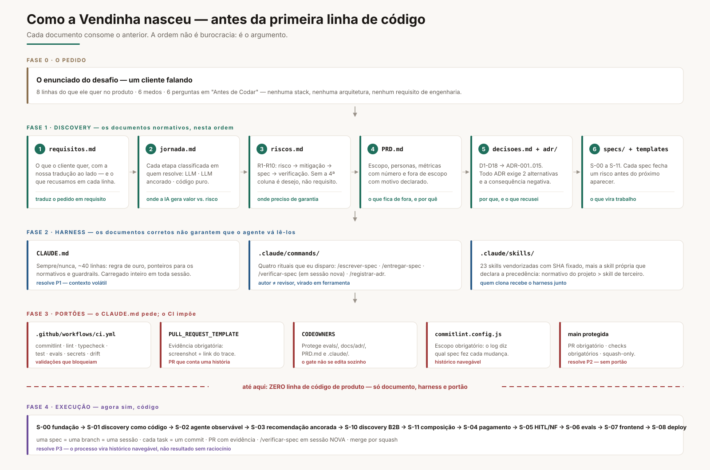
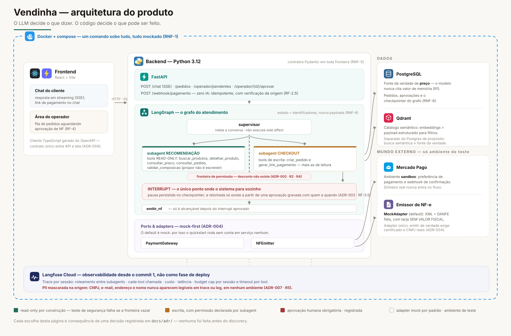

# Arquitetura — Vendinha

> Este documento vem **depois** de `docs/requisitos.md`, `docs/jornada.md`, `docs/riscos.md`,
> `docs/PRD.md` e dos ADRs — nessa ordem, e não por acaso. A arquitetura aqui não é ponto de
> partida: é **consequência**. Cada linha de stack desta página aponta para uma decisão que já
> estava registrada antes de existir código.

**Regra que governa o desenho inteiro:**
> O LLM decide o que dizer. O código decide o que pode ser feito.

---

## 1. Como o repositório foi construído — antes da primeira linha de código



O enunciado entrega um cliente falando. Da tradução em diante, o repositório é o único lugar
onde a decisão existe. As quatro fases acima aconteceram **inteiras** antes de qualquer código
de produto:

| Fase | O que entra no repositório | O que isso resolve |
|---|---|---|
| **0 · O pedido** | nada ainda — só a leitura do enunciado | separar desejo de requisito |
| **1 · Discovery** | `requisitos.md` → `jornada.md` → `riscos.md` → `PRD.md` → `decisoes.md` + `adr/` → `specs/` | cada documento consome o anterior; risco sem verificação é desejo |
| **2 · Harness** | `CLAUDE.md`, `.claude/commands/`, `.claude/skills/` | **P1** — contexto volátil: o que eu expliquei uma vez vira artefato versionado |
| **3 · Portões** | `.github/`, `commitlint.config.js`, CODEOWNERS, `main` protegida | **P2** — sem portão: o `CLAUDE.md` pede, o CI impõe |
| **4 · Execução** | S-00 → S-09, uma spec por branch e por sessão | **P3** — processo invisível: o histórico vira o argumento |

---

## 2. A stack — e a decisão que obrigou cada linha

| Camada | Escolha | A decisão que a exigiu | Alternativa recusada |
|---|---|---|---|
| Linguagem | **Python 3.12** | Ecossistema de agente e RAG maduro; contratos Pydantic em toda fronteira (RNF-5) | Node no backend: tipagem boa, ecossistema de agente mais raso |
| Orquestração | **LangGraph** | D5 · ADR-003 — `interrupt` com estado **persistido** em checkpointer. A pausa antes da NF não é UX, é primitivo | Agente em loop com um `if` no meio: pausa que morre junto com o processo |
| Observabilidade | **Langfuse Cloud** | D10 · ADR-007 — trace por sessão com mascaramento de PII **na origem**; D13 · ADR-010 — é o mascaramento que garante a privacidade, não a topologia, então a hospedagem vira questão de custo operacional | LangSmith: com mascaramento na origem a PII não sai de nenhum jeito — o que falta é a saída. Langfuse é open-source: trocar nuvem por self-hosted é variável de ambiente, não reescrita |
| API | **FastAPI** | ADR-004 — Pydantic → OpenAPI → cliente TypeScript gerado; SSE nativo para o streaming do chat | Flask/Django: OpenAPI não sai de graça |
| Dados | **PostgreSQL + Qdrant** | Postgres é a fonte da verdade de preço **e** o checkpointer do grafo (RNF-6); Qdrant carrega o catálogo semântico | pgvector: um serviço a menos, mas fundiria busca semântica com fonte da verdade |
| Frontend | **React + Vite** | Dois consumidores da mesma API: chat do cliente e fila do operador (RF-4) | Next/SSR: nada aqui precisa de SEO |
| Empacotamento | **Docker + compose** | *"sistema que sua equipe consiga colocar para rodar"*: um comando, tudo mockado (RNF-1) | Instruções de instalação num README |
| Pagamento | **Mercado Pago sandbox** | Requisito do enunciado: só ambiente de teste. Port + adapter (ADR-004) | Gateway real: dinheiro de verdade num projeto de demonstração |
| Documento fiscal | **NFEmitter: Mock (default) / Homologação (opcional)** | ADR-004 — mock fiel ao layout NF-e modelo 55, com tarja SEM VALOR FISCAL | Emissão real: certificado e CNPJ no caminho do quickstart |

---

## 3. O desenho do produto



### 3.1 Quantos agentes, e por que essa divisão

Um **supervisor** roteia a conversa e **dois subagents** executam. A divisão não é organizacional
— é a **fronteira de permissão** (ADR-002):

| Agente | Tools registradas | Pode escrever? |
|---|---|---|
| `supervisor` | roteamento | não |
| `recomendacao` | `buscar_produtos`, `detalhar_produto`, `consultar_preco` | **não** — só read-only |
| `checkout` | `criar_pedido`, `gerar_link_pagamento` | sim, com schema rígido |

`desconto` **não existe** como tool em nenhum registro. Não é uma ação negada por prompt: ela
não está lá. Um teste unitário falha se qualquer tool de escrita vazar para o registro do
subagent de recomendação (R2, R4).

### 3.2 Onde entra o humano

Um ponto, e só um: **antes de `emitir_nf`**.

1. Pagamento confirmado por webhook (zero IA, idempotente, origem verificada).
2. O pedido entra em `aguardando_aprovacao_nf` e o grafo **pausa** — `interrupt` com estado
   persistido no checkpointer Postgres.
3. O operador vê a fila com os dados completos da nota e aprova ou rejeita.
4. A decisão é gravada com **quem e quando**; a retomada só existe a partir desse registro.

É impossível, por construção, emitir NF sem aprovação registrada — e isso é testado em
integração, não prometido em prosa (ADR-003, RF-3.5, R3).

### 3.3 Gestão de falhas

| Falha | Comportamento |
|---|---|
| Gateway ou emissor fora do ar | Port + adapter: degradação graciosa e testes de contrato por adapter (ADR-004, R8) |
| Webhook duplicado | Idempotência por chave do evento — o efeito acontece uma vez só (RF-2.5) |
| Conversa longa / processo reiniciado | Checkpointer em Postgres; estado carrega identificadores, nunca payloads (RNF-6, R9) |
| Tool travada ou custo escalando | Timeout por tool e budget cap por sessão, medidos no mesmo trace (RNF-3, R6) |
| Modelo tentando ação fora da allowlist | A ação não existe no registro do subagent; a suite adversarial cobre a tentativa (R4) |
| Regressão de qualidade após mudar prompt | Evals golden e adversariais bloqueiam o merge (ADR-006, R7) |

### 3.4 Fluxo de dados, em uma passada

```
cliente → chat (SSE) → supervisor
   ├─ recomendação → Qdrant (semântica) + Postgres (preço)  ......... nenhum fato sai da memória do modelo
   └─ checkout     → Postgres (pedido) + Mercado Pago sandbox (link)
                          ↓
                  webhook de pagamento (código puro)
                          ↓
                  ⏸ interrupt → operador aprova (registrado)
                          ↓
                  emitir_nf → NFEmitter (mock por padrão)
                          ↓
                  cliente recebe DANFE/XML no chat

  Langfuse Cloud observa tudo acima, desde o commit 1, com PII mascarada na origem (ADR-010).
```

---

## 4. O que esta arquitetura deliberadamente **não** faz

- Não guarda catálogo no prompt — nem parcialmente.
- Não calcula preço, total ou desconto no modelo.
- Não permite emissão de documento fiscal sem registro de aprovação humana.
- Não escreve PII legível em trace ou log, em nenhum ambiente.
- Não sobe para produção sem os checks obrigatórios do CI verdes.

Cada item acima corresponde a uma linha de `docs/riscos.md` com uma verificação automatizada.
Risco sem verificação é desejo, não requisito.

---

## 5. Como regenerar as imagens

A fonte de cada diagrama é o **SVG** em `docs/img/` — texto, não binário, então o diff mostra
exatamente o que mudou. Os `.png` ao lado são exportações em 2x (3200×2120 e 3280×2160),
para slides e thumbnail de vídeo.

| Arquivo | Uso |
|---|---|
| `img/fluxo-discovery.svg` · `.png` | como o repositório nasceu, antes do código |
| `img/arquitetura-produto.svg` · `.png` | arquitetura do produto com a stack |

Depois de editar um SVG, regere os PNGs:

```bash
chrome --headless=new --disable-gpu --hide-scrollbars --force-device-scale-factor=2 \
  --window-size=1600,1060 --screenshot=docs/img/fluxo-discovery.png \
  docs/img/fluxo-discovery.svg

chrome --headless=new --disable-gpu --hide-scrollbars --force-device-scale-factor=2 \
  --window-size=1640,1080 --screenshot=docs/img/arquitetura-produto.png \
  docs/img/arquitetura-produto.svg
```
